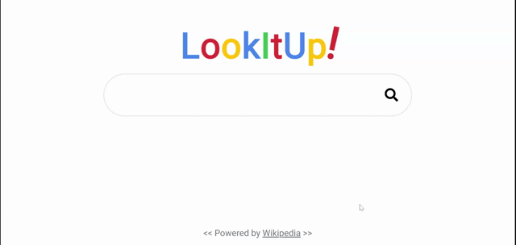

<h1 align="center">LookItUp!</h1> 
  <h2>Table of Contents<h2>
  <ul>
    <li>
      <a href="#description">Description</a>
    </li>
    <li>
      <a href="#demo">Demo</a>
    </li>
    <li>
      <a href="#install">Try it!</a>
    </li> 
    <li>
      <a href="#tech">Technology</a>
    </li> 
    <li>
      <a href="#license">License</a>
    </li>
    <li>
      <a href="#contr">Contributors</a>
    </li>
  </ul>
  
  

  
  
<h2>Description</h2>

  
A JavaScript search engine that consumes the Wikipedia API. Styled with Sass.

  

  
  
<h2>Demo</h2>

  

  
  

  
<h2>Try it!</h2> 

  
visit <a href="https://gregroyclark.github.io/lookitup/" target="_blank">https://gregroyclark.github.io/lookitup/</a>

  
  

  
  
<h2>Technology</h2>
           
  
Semantic HTML, Sass, JavaScript

  
  

  
  
<h2>License</h2>

  

  
   
  

  
  
<h2>Contributors</h2>

  

    Github:
      <a href="https://github.com/gregroyclark/" target="_blank">
        https://github.com/gregroyclark/
      </a>
  
